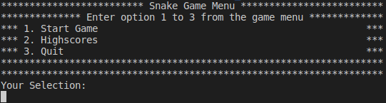
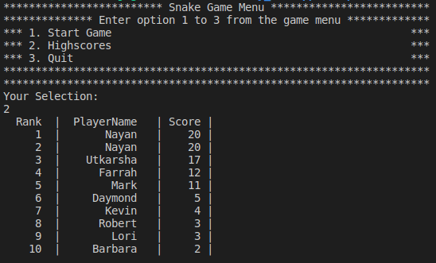
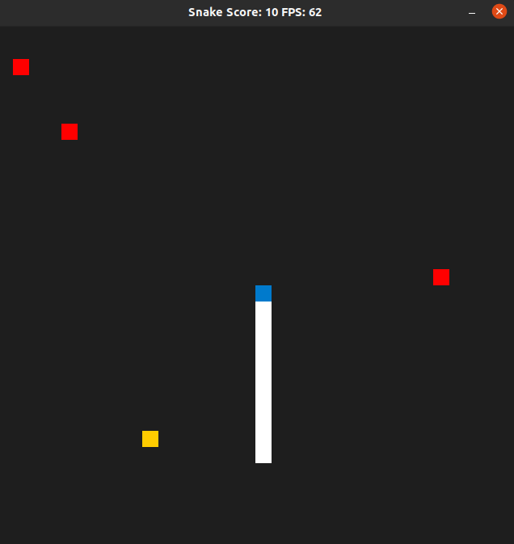
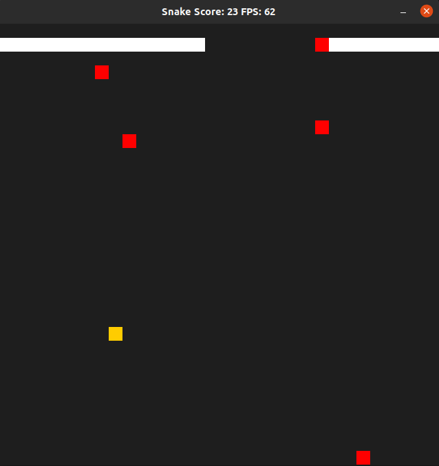
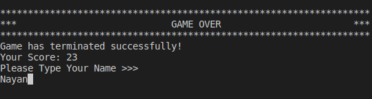
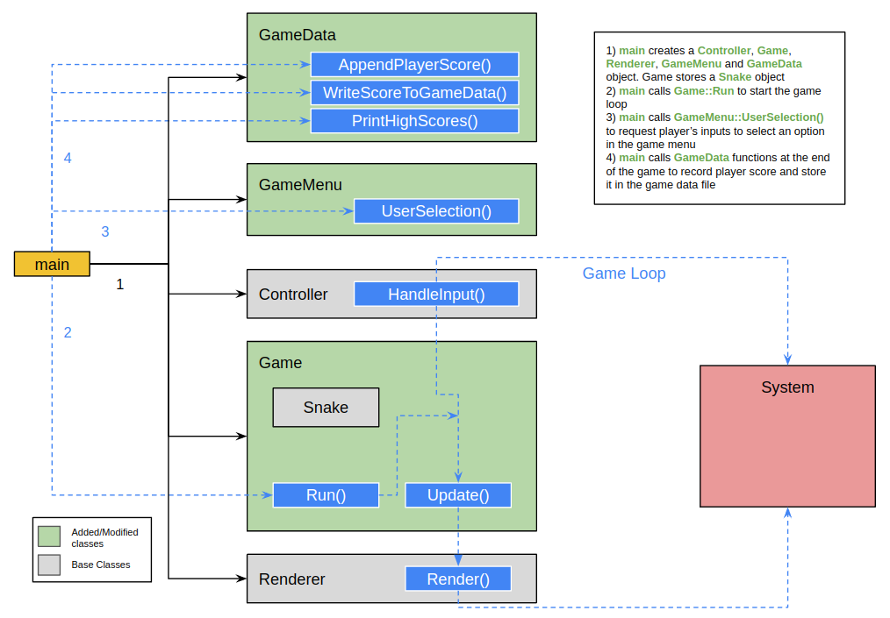

# CPPND: Capstone Snake Game

This repository contains the code for the Capstone project which is a part of the Udacity C++ Nanodegree.

The project code in this repository is based off of the starter code provided in [CppND-Capstone-Snake-Game](https://github.com/udacity/CppND-Capstone-Snake-Game) github repository

## Added Features
* The player is presented with a `GameMenu` to select amongst the options available in the menu. The game menu is displayed in the terminal as shown here:

  * Selecting the first option - `1. Start Game`, launches a new game
  * Second option - `2. Highscores` displays the leaderboard. It prints out the top ten scores ever achieved by the players who played this game
  
  * The last option - `3. Quit`, allows the player to successfully terminate the game
* To make the game more exciting and increasing the challenge periodically throughout the game playing time, `Posion` is added to the game. The poison blocks are added randomly one by one everytime the score increases by 5. The snake dies after eating the poison block and the game is over.
 
* Game window automatically terminates when the snake dies as the game is over. 
* At the end of the game, the player's score is displayed in the terminal and further the player's score is compared with the top ten scores on the leaderboard. Based on:
  * If the player's score is less than the minimum score in the leaderboard, the game shows the leaderboard to the player and takes them back to the game menu.
  * If the player's score is greater than the minimum score in the leaderboard, the game asks the player to provide their name and subsequently stores their name and score in the leaderboard and takes out the last leaderboard entry to ensure that the leaderboard stores only the top ten scores of all time. The game displays the new leaderboard and then takes the player back to the game menu.
  

## Dependencies for Running Locally
* cmake >= 3.7
  * All OSes: [click here for installation instructions](https://cmake.org/install/)
* make >= 4.1 (Linux, Mac), 3.81 (Windows)
  * Linux: make is installed by default on most Linux distros
  * Mac: [install Xcode command line tools to get make](https://developer.apple.com/xcode/features/)
  * Windows: [Click here for installation instructions](http://gnuwin32.sourceforge.net/packages/make.htm)
* SDL2 >= 2.0
  * All installation instructions can be found [here](https://wiki.libsdl.org/Installation)
  >Note that for Linux, an `apt` or `apt-get` installation is preferred to building from source. 
* gcc/g++ >= 5.4
  * Linux: gcc / g++ is installed by default on most Linux distros
  * Mac: same deal as make - [install Xcode command line tools](https://developer.apple.com/xcode/features/)
  * Windows: recommend using [MinGW](http://www.mingw.org/)

## Basic Build Instructions

1. Clone this repo.
2. Make a build directory in the top level directory: `mkdir build && cd build`
3. Compile: `cmake .. && make`
4. Run it: `./SnakeGame`.

## Overview of Code Structure

The Snake game code consists of six main classes: `Game`, `Snake`, `Controller`, `Renderer`, `GameMenu` and `GameData`. The image below shows how the code functions:

## Rubric Items Satisfied by the New Features

### README
| Criteria | Explanation | Reference(s) |
| -------- | ----------- | ------------ |
| A README with instructions is included with the project | The README is included with the project and has instructions for building/running the project. | - |
| The README indicates which project is chosen. | The README indicates the project selected. It also presents the file and class structure and describes the expected behavior or output of the game. | - |
| The README includes information about each rubric point addressed. | The README indicates which rubric points are addressed. The README also indicates where in the code (i.e. files and line numbers) that the rubric points are addressed. | - |

### Compiling and Testing
| Criteria | Explanation | Reference(s) |
| -------- | ----------- | ------------ |
| The submission must compile and run. | The project code compiles and runs without errors. | - |

### Loops, Functions, I/O
| Criteria | Explanation | Reference(s) |
| -------- | ----------- | ------------ |
| The project demonstrates an understanding of C++ functions and control structures. | A variety of control structures are used in the project and the project code is clearly organized into functions. One example of function and control structure is attached in the adjacent references. | **Function**: [gamedata.cpp](https://github.com/nayan3090/Capstone-Snake-Game/blob/master/src/gamedata.cpp) (line 29 onwards), **Control structure**: [main.cpp](https://github.com/nayan3090/Capstone-Snake-Game/blob/master/src/main.cpp) (line 21-38) |
| The project reads data from a file and process the data, or the program writes data to a file. | The project reads game leaderboard data from the [gamedata.txt](https://github.com/nayan3090/Capstone-Snake-Game/blob/master/data/gamedata.txt) file as well as writes the score and player information to the [gamedata.txt](https://github.com/nayan3090/Capstone-Snake-Game/blob/master/data/gamedata.txt) file. | **Read**: [gamedata.cpp](https://github.com/nayan3090/Capstone-Snake-Game/blob/master/src/gamedata.cpp) (line 10-26), **Write**: [gamedata.cpp](https://github.com/nayan3090/Capstone-Snake-Game/blob/master/src/gamedata.cpp) (line 84-92) |
| The project accepts user input and processes the input. | The project presents a game menu to the player before starting the game to accept the player's input and subsequently, processes the input to execute the program as per the input. | **User input**: [gamemenu.cpp](https://github.com/nayan3090/Capstone-Snake-Game/blob/master/src/gamemenu.cpp) (line 6-29), [gamedata.cpp](https://github.com/nayan3090/Capstone-Snake-Game/blob/master/src/gamedata.cpp) (line 75-81), **Input processing**: [main.cpp](https://github.com/nayan3090/Capstone-Snake-Game/blob/master/src/main.cpp) (line 18-38 and line 60-61) |

### Object Oriented Programming
| Criteria | Explanation | Reference(s) |
| -------- | ----------- | ------------ |
| The project uses Object Oriented Programming techniques. | The project code is organized into classes with class attributes to hold the data, and class methods to perform tasks. | [gamemenu.h](https://github.com/nayan3090/Capstone-Snake-Game/blob/master/src/gamemenu.h), [gamedata.h](https://github.com/nayan3090/Capstone-Snake-Game/blob/master/src/gamedata.h) |
| Classes use appropriate access specifiers for class members. | All class data members are explicitly specified as public or private. | [gamemenu.h](https://github.com/nayan3090/Capstone-Snake-Game/blob/master/src/gamemenu.h), [gamedata.h](https://github.com/nayan3090/Capstone-Snake-Game/blob/master/src/gamedata.h) |
| Class constructors utilize member initialization lists. | The `GameData` class member `_fileName` is initialized using member initialization list | [gamedata.cpp](https://github.com/nayan3090/Capstone-Snake-Game/blob/master/src/gamedata.cpp) (line 10) |
| Classes encapsulate behavior. | Quite a few functions and data are grouped together into classes as they are important for the correct working of the class object. A couple examples to point out in this project are - the `PlacePoison` function in `game.cpp` and `AddPlayerName` function in `gamedata.cpp` | [game.cpp](https://github.com/nayan3090/Capstone-Snake-Game/blob/master/src/game.cpp) (line 79-115), [gamedata.cpp](https://github.com/nayan3090/Capstone-Snake-Game/blob/master/src/gamedata.cpp) (line 75-81) |

### Memory Management

